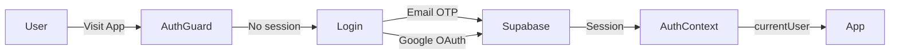

# 🖥️ Frontend Guide

This document describes the primary pages, services, and components of the React Frontend within the `orchable` module.

---

## 1. `src/` Directory Structure

```
src/
├── App.tsx              # Main Router (React Router v6)
├── pages/               # Application Pages
│   ├── Home.tsx         # Landing page
│   ├── Designer.tsx     # Orchestrator Designer (wrapper)
│   ├── Launcher.tsx     # Batch Launching
│   ├── Monitor.tsx      # Progress Monitoring
│   ├── BatchProgress.tsx# Detailed Batch View
│   ├── AssetLibrary.tsx # Prompt Template + Custom Component Management
│   ├── Calculator.tsx   # Token Cost Estimation
│   ├── Settings.tsx     # System Settings
│   ├── Login.tsx        # Email/Google Login
│   └── NotFound.tsx     # 404 Page
├── components/
│   ├── designer/        # Orchestrator Designer (ReactFlow)
│   │   ├── StageConfigPanel.tsx    # Stage Configuration Panel
│   │   ├── ContractSection.tsx     # IO Schema editor
│   │   ├── PromptEditorDialog.tsx  # Rich prompt editor (reused in AssetLibrary)
│   │   ├── OutputSchemaEditor.tsx  # JSON Schema visual editor
│   │   ├── IconPicker.tsx          # Lucide Icon Picker for stages
│   │   └── PrePostProcessSection.tsx # Hooks configuration
│   ├── batch/           # Monitor/Batch Components
│   │   ├── TaskHierarchyTree.tsx   # Task tree with result viewing + component editing
│   │   ├── ComponentEditor.tsx     # TSX Component editor (sandbox)
│   │   ├── CustomComponentRenderer.tsx # Renders TSX within the sandbox
│   │   ├── SchemaRenderer.tsx      # Renders JSON schema (hide/show columns)
│   │   └── MergeResultsPanel.tsx   # Merges results from multiple tasks
│   └── common/
│       ├── AppSidebar.tsx          # Navigation sidebar
│       └── IconPicker.tsx          # (shared)
├── services/
│   ├── stageService.ts          # CRUD for prompt_templates + custom_components
│   ├── pricingService.ts        # Fetches Gemini pricing table
│   ├── taskActionService.ts     # Retry, Delete task/batch
│   ├── executionTrackingService.ts # Real-time execution tracking
│   ├── executionService.ts      # Execution initialization
│   ├── configService.ts         # Orchestrator configuration reader
│   ├── compilerService.ts       # Compiles TSX using Sucrase
│   └── n8nService.ts            # n8n API integration
├── stores/
│   └── designerStore.ts         # Zustand store for Designer state
├── lib/
│   ├── types.ts          # Global TypeScript types
│   ├── supabase.ts       # Supabase client
│   ├── utils.ts          # cn() and utilities
│   ├── icons.ts          # ICONS Registry (Lucide)
│   ├── schemaUtils.ts    # JSON Schema processing utilities
│   ├── componentSandbox.ts # Sandbox validation + execution
│   └── constants/        # Constants (default configs, etc.)
└── contexts/
    └── AuthContext.tsx   # Auth state (currentUser, signIn, signOut)
```

---

## 2. Primary Pages

### 🎨 Designer (`/designer`)
The node-graph-based Orchestrator design interface (ReactFlow).

**Features:**
- Drag-and-drop addition of new Stages.
- Connect Stages by dragging edges.
- `StageConfigPanel` (right sidebar): Detailed configuration for each stage across 6 tabs (Basic, Prompt, IO, AI, Hooks, Visual).
- Load configurations from the library (Recent Configs).
- Export/Import stage configurations (JSON).
- **Save Config**: Synchronizes all stages to Supabase `prompt_templates` via `syncStagesToPromptTemplates()`.

### 🚀 Launcher (`/launcher`)
Select pre-configured Orchestrators and upload data to run batches.

**Features:**
- List of Orchestrator configs with graph previews.
- Excel/CSV Upload → Data preview.
- Batch configuration (name, launch parameters).
- Create batch and redirect to Monitor.

### 📊 Monitor (`/batch/:id` and `/monitor`)
Tracks execution progress in real-time.

**Features:**
- Real-time task status updates (Supabase Realtime).
- Filtering by stage and status.
- `TaskHierarchyTree`: In-depth task details in a tree structure.
  - Formatted results viewing (Custom Component) or Raw JSON.
  - View Component editing (TSX sandbox).
  - CSV Export.
  - Results Merging.
- Retry individual failed tasks / Retry All Failed.
- Delete batches.

### 📚 Asset Library (`/assets`)
Centralized management for Prompt Templates and Custom Components (TSX).

**Tabs:**
1. **View Components**: List of `custom_components` with card previews. Opens the `ComponentEditor` for code sandbox editing.
2. **Prompt Templates**: List of `prompt_templates`. Edit prompts using `PromptEditorDialog` (syntax highlighting, variable scanning, delimiter configuration).

### 🧮 Calculator (`/calculator`)
Estimates Gemini API token costs before running large batches.

**Features:**
- Select Orchestrator configuration.
- Upload sample data.
- Precise input token calculation (from actual prompt + data).
- Output token estimation (from output schema).
- Cost breakdown by stage and cardinality.
- Live pricing table fetched from the Gemini pricing page.

---

## 3. Key Services

### `stageService.ts`
- `syncStagesToPromptTemplates()`: Syncs Orchestrator stages → Supabase `prompt_templates`.
- `getCustomComponents()`: Fetches custom components.
- `createCustomComponent()` / `updateCustomComponent()`: Component CRUD.
- `linkTemplateToComponent()`: Links a template to a component.
- `updateTemplateCustomComponent()`: Saves local TSX overrides to `view_config`.

### `taskActionService.ts`
- `retryTask(id)`: Resets a task status to `plan`.
- `retryAllFailedInBatch(batchId)`: Retries all failed tasks within a batch.
- `deleteBatch(batchId)`: Deletes a batch with cascading task deletion.

### `pricingService.ts`
- Fetches Gemini pricing from the Google AI pricing page.
- Caches results to minimize requests.

### `executionTrackingService.ts`
- Subscribes to Supabase Realtime for task status updates.
- Calculates batch progress (total / completed / failed).

### `compilerService.ts`
- Compiles TSX source code using Sucrase within the browser.
- Injects global scope (React, shadcn/ui components, Lucide icons, cn utility).
- Performs security validation prior to execution.

---

## 4. Custom Component Sandbox

Users can write TSX Components to render task output in specialized ways:

```tsx
// Basic structure
const Component = ({ data, schema }) => {
    return <div>{data.some_field}</div>;
};
```

**Available Globals in Sandbox:**
- `React`, `useState`, `useEffect`, `useMemo`, `useCallback`.
- `cn` (classNames utility).
- All shadcn/ui components: `Badge`, `Card`, `Table`, `Button`, etc.
- All Lucide icons.
- **Forbidden**: `window`, `fetch`, `eval`, `document.createElement`.

**Execution Flow:**
1. Validation (checking for dangerous patterns).
2. Sucrase compilation (TSX → JS).
3. Execution within a function scope with injected globals.
4. `Component` extraction and rendering with `data` = `task.output_data`.

---

## 5. Authentication Flow



- `AuthContext` (`contexts/AuthContext.tsx`): Provides `currentUser`, `signIn()`, `signOut()`, and `loading` state.
- Route protection: All routes require `currentUser !== null`.
- Supabase RLS: `auth.uid()` is used to filter data by user.

*Last Updated: 2026-02-24*
