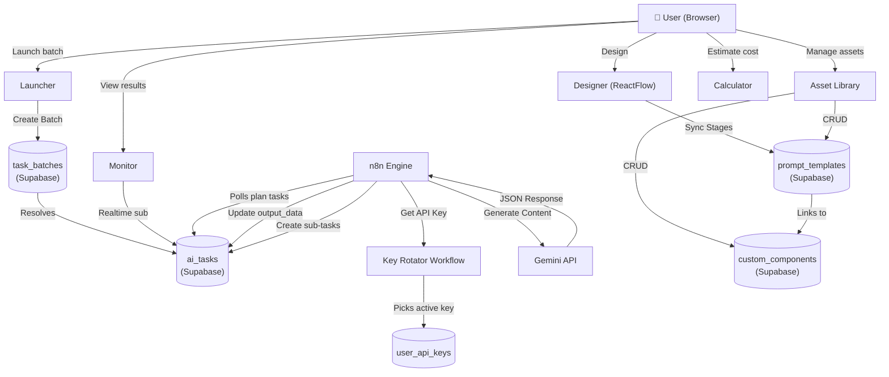
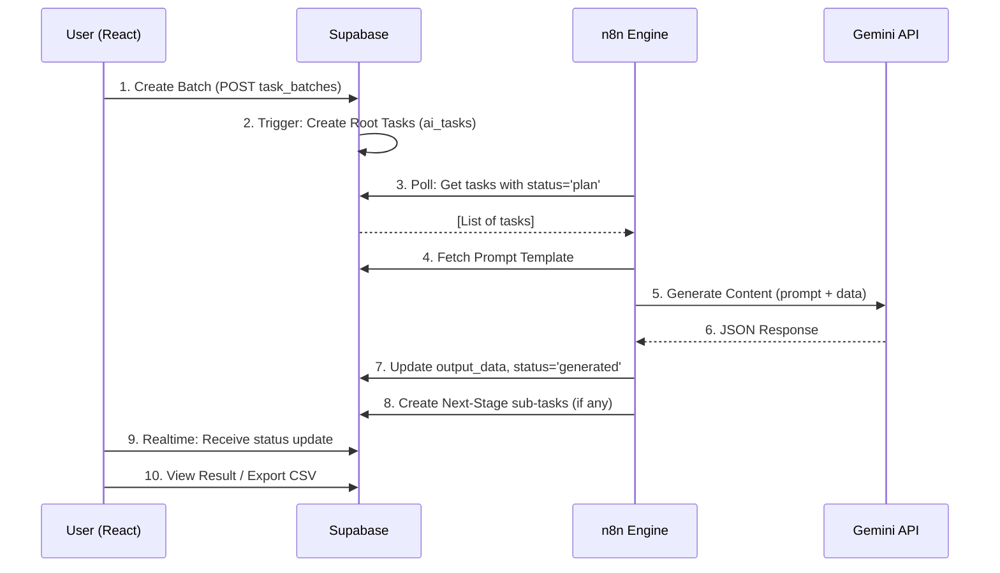

# 🏛️ System Architecture

## 1. Overview

**Orchable** uses a 4-tier **Hybrid** architecture: a modern React Frontend, Supabase as the database and message queue, n8n as the workflow engine, and Google Gemini API as the AI engine.

Goal: Automate any multi-step AI content generation pipeline through a configurable, visual interface — domain-agnostic.

---

## 2. Main Components

### A. Frontend (React + Vite + TypeScript)
- **Tech Stack**: React 19, TypeScript, Vite, Tailwind CSS, shadcn/ui, ReactFlow
- **Role**: Full UI — workflow design, batch launching, progress tracking, asset management
- **Main Pages**:

| Page | Route | Description |
|---|---|---|
| Home | `/` | Landing page + quick start |
| Designer | `/designer` | Visual drag-drop Orchestrator pipeline builder |
| Launcher | `/launcher` | Launch batch jobs from Orchestrator configs |
| Monitor | `/batch/:id` | Track progress, view results, retry, delete |
| Asset Library | `/assets` | Manage Prompt Templates + Custom Components |
| Calculator | `/calculator` | Gemini token cost estimator |
| Settings | `/settings` | System config, API key management |
| Login | `/login` | Email/Google OAuth (Supabase Auth) |

### B. Backend / Database (Supabase)
- **Role**: Single Source of Truth. Stores all config, task queue, results, users
- **Tech**: PostgreSQL with RLS (Row Level Security), Realtime subscriptions
- **RLS Strategy**: Users see only their own data + `is_public = true` records
- **Key Tables**: `ai_tasks`, `task_batches`, `prompt_templates`, `custom_components`, `user_api_keys`

### C. Workflow Engine (n8n Self-hosted)
- **Role**: AI task worker. Polls Supabase, calls Gemini, writes results back
- **Tech**: n8n, JavaScript (Node.js)
- **Mechanism**: Database-driven queue — `ai_tasks` table is the queue, n8n is the consumer

### D. AI Engine (Google Gemini API)
- **Default Model**: `gemini-2.0-flash` (fast, cheap), `gemini-pro` (high quality)
- **Mechanism**: Key Rotation Pool — cycles through multiple API keys to avoid rate limits
- **Structured Output**: Uses `responseMimeType: application/json` + `responseJsonSchema` for native JSON responses

---

## 3. Interaction Diagram



---

## 4. Data Flow



---

## 5. Orchestrator System (Designer)

The Orchestrator allows users to design multi-step AI pipelines using a drag-and-drop interface:

```
Launcher Input → [Stage A: Core Questions] → [Stage B: Qualified Filter] → [Stage C: Format Output]
```

- Each **Stage** corresponds to a `prompt_template` in Supabase.
- Connections between stages are defined by `next_stage_template_ids`.
- Config per stage: `cardinality` (1:1, 1:N, N:1), `split_path`, `merge_path`, `requires_approval`.
- When the user clicks **Save Config**, all stages are synced as records in `prompt_templates` via `syncStagesToPromptTemplates()`.

---

## 6. Custom Component System (Asset Library)

Users can write **custom UI Components (TSX)** to render task results in specialized ways:

```
ai_task.output_data → [Custom TSX Component Sandbox] → Rendered HTML
```

- Components are sandboxed in `componentSandbox.ts` (no `window`, `fetch`, `eval`).
- Source code is compiled by **Sucrase** directly in the browser.
- Can be saved to the **Asset Library** (`custom_components`) for reuse across stages.
- The Monitor allows inline component editing and publishing to the Registry or saving as a local override.

---

## 7. Key Design Decisions

| Decision | Rationale |
|---|---|
| Database-driven Queue | Scalable, no need for a separate message broker |
| Script-based n8n nodes | Version control via Git, easy to debug |
| Dynamic Orchestration via DB | Add/edit flows without redeploying |
| Sucrase sandbox (browser-side) | Realtime component preview, no server needed |
| Supabase Realtime | Instant task status updates |
| Gemini Structured Output | Reduced JSON parse errors, increased reliability |

*Updated: 2026-02-24*
