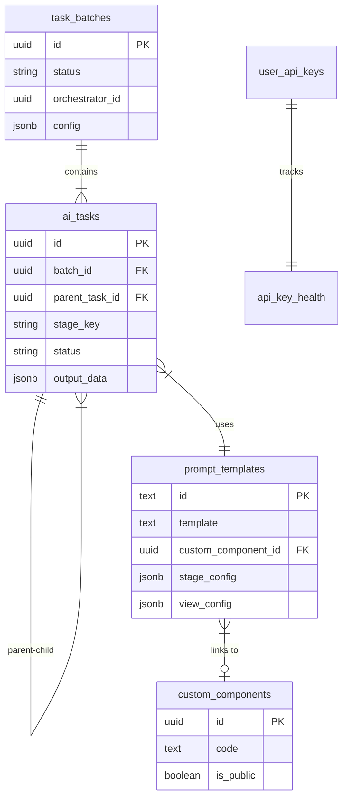

# 🗄️ Database Schema

The system utilizes PostgreSQL on Supabase. Below is a detailed description of the tables within the `n8n-gen` module.

---

## 1. Core Table: `ai_tasks`

The central table, serving both as data storage and as a **Queue** for AI Agents.

| Column | Type | Description |
| :--- | :--- | :--- |
| `id` | UUID | Primary Key |
| `task_type` | VARCHAR | Task type, used for routing (e.g., `core_question_gen`) |
| `stage_key` | VARCHAR | Stage key within the Orchestrator (e.g., `core_question`) |
| `status` | VARCHAR | `plan` → `processing` → `generated` → `completed` / `failed` |
| `input_data` | JSONB | Input data for the prompt |
| `output_data` | JSONB | JSON result from AI (alias `result`) |
| `error_message` | TEXT | Error log if failed |
| `prompt_template_id` | TEXT | Template ID used to generate content |
| `batch_id` | UUID | FK → `task_batches` |
| `parent_task_id` | UUID | Parent task (if a sub-task) |
| `root_task_id` | UUID | Original root task in the chain |
| `hierarchy_path` | JSONB | Array of ancestor IDs: `[root_id, ..., parent_id]` |
| `step_number` | INT | Step order in the flow |
| `next_task_config` | JSONB | Next Stage configuration |
| `extra` | JSONB | Extended config: `grt`, `pre_process`, `post_process` |
| `launch_id` | UUID | Session ID for a specific run |
| `requires_approval` | BOOLEAN | Enabled when manual approval is needed before proceeding |
| `approved_at` | TIMESTAMPTZ | Timestamp of approval |
| `retry_count` | INT | Number of retries performed |

---

## 2. Batch Table: `task_batches`

Manages run batches (e.g., creating course material for an entire grade).

| Column | Type | Description |
| :--- | :--- | :--- |
| `id` | UUID | Primary Key |
| `name` | VARCHAR | Batch name |
| `orchestrator_id` | UUID | FK → Orchestrator configuration |
| `status` | VARCHAR | `pending`, `processing`, `completed`, `failed`, `paused` |
| `total_tasks` | INT | Expected total root tasks |
| `completed_tasks` | INT | Number of completed tasks |
| `failed_tasks` | INT | Number of failed tasks |
| `config` | JSONB | General configuration for the batch |
| `launch_id` | UUID | Run identifier |

---

## 3. Prompt Template Table: `prompt_templates`

Stores all prompts and stage configurations for the Orchestrator.

| Column | Type | Description |
| :--- | :--- | :--- |
| `id` | TEXT | Primary Key (typically `orchestratorId_stageKey_stageId`) |
| `name` | VARCHAR | Template name |
| `description` | TEXT | Description |
| `template` | TEXT | Prompt content |
| `version` | INT | Version |
| `is_active` | BOOLEAN | Whether it is currently active |
| `default_ai_settings` | JSONB | Model, temperature, topP, topK, maxOutputTokens |
| `input_schema` | JSONB | JSON schema for input data |
| `output_schema` | JSONB | JSON schema for output (used for structured output) |
| `stage_config` | JSONB | Stage configuration: cardinality, split_path, merge_path, etc. |
| `next_stage_template_ids` | TEXT[] | Array of template IDs for the next stage |
| `requires_approval` | BOOLEAN | Requires approval before proceeding |
| `organization_code` | TEXT | ID of the Orchestrator owning the template |
| `custom_component_id` | UUID | FK → `custom_components` (Custom View component) |
| `view_config` | JSONB | Display configuration: `hiddenFields`, `delimiters`, etc. |

---

## 4. Asset Registry Table: `custom_components` *(New — 2026-02-24)*

Repository for custom UI Components written in TSX, used to render task results in specialized ways.

| Column | Type | Description |
| :--- | :--- | :--- |
| `id` | UUID | Primary Key |
| `name` | VARCHAR | Component name |
| `description` | TEXT | Description |
| `code` | TEXT | TSX source code (executed within a sandbox) |
| `mock_data` | JSONB | Mock data for previewing |
| `is_public` | BOOLEAN | Publicly accessible to all users |
| `created_at` | TIMESTAMPTZ | Creation timestamp |
| `created_by` | UUID | FK → `auth.users` |

---

## 5. API Key Table: `user_api_keys`

Manages the pool of API Keys for rotation to avoid rate limits.

| Column | Type | Description |
| :--- | :--- | :--- |
| `id` | UUID | Primary Key |
| `key_name` | VARCHAR | Mnemonic name |
| `api_key_encrypted` | TEXT | API Key content |
| `is_active` | BOOLEAN | Automatically switches to `false` if too many errors occur |
| `priority` | INT | Usage priority |
| `model_preference` | VARCHAR | Default model (e.g., `gemini-2.0-flash`) |

---

## 6. Key Health Table: `api_key_health`

| Column | Type | Description |
| :--- | :--- | :--- |
| `user_api_key_id` | UUID | FK → `user_api_keys` |
| `last_used_at` | TIMESTAMPTZ | Last used timestamp |
| `consecutive_failures` | INT | Number of consecutive failures |
| `blocked_until` | TIMESTAMPTZ | Blocking expiration timestamp |
| `block_reason` | VARCHAR | Reason for blocking |

---

## ERD Overview

---

## List of Migrations (Chronological)

| File | Date | Description |
|------|------|-------|
| `ai_tasks_schema.sql` | Base | Original schema for ai_tasks |
| `task_batches_schema.sql` | Base | Original schema for task_batches |
| `prompt_templates_schema.sql` | Base | Original schema for prompt_templates |
| `20260215_generalize_task_batches.sql` | 2026-02-15 | Generalization of task_batches |
| `20260216_fix_batch_counter_trigger.sql` | 2026-02-16 | Fix for task counter trigger |
| `20260216_fix_rls_permissive.sql` | 2026-02-16 | Relaxed RLS to fix access errors |
| `20260217_fix_launch_id_propagation.sql` | 2026-02-17 | Fix for lost launch_id during sub-task creation |
| `20260220_add_n1_merge_support.sql` | 2026-02-20 | Added N:1 merge support |
| `20260221_add_input_mapping_to_configs.sql` | 2026-02-21 | Added input_mapping |
| `20260221_fix_rpc_and_counters.sql` | 2026-02-21 | Fix for RPC and counters |
| `20260221_optimize_view_performance.sql` | 2026-02-21 | Optimized `v_runnable_tasks` view |
| `20260222_add_isolated_batch_creation.sql` | 2026-02-22 | Added isolated batch_grouping |
| `20240223_add_view_config_to_prompt_templates.sql` | 2026-02-23 | Added `view_config` column |
| `20260223_add_delete_policies.sql` | 2026-02-23 | Added RLS delete + cascade RPC |
| `20260223_add_retry_rpc.sql` | 2026-02-23 | Added RPC for task/batch retry |
| `20260223_tighten_rls.sql` | 2026-02-23 | Tightened RLS isolation by user |
| `20260224_add_custom_components_table.sql` | 2026-02-24 | **Created `custom_components` table + linkage** |

*Last Updated: 2026-02-24*
