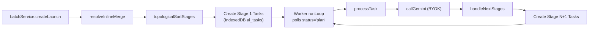
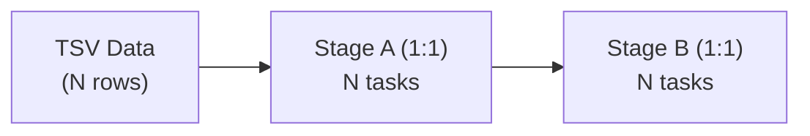
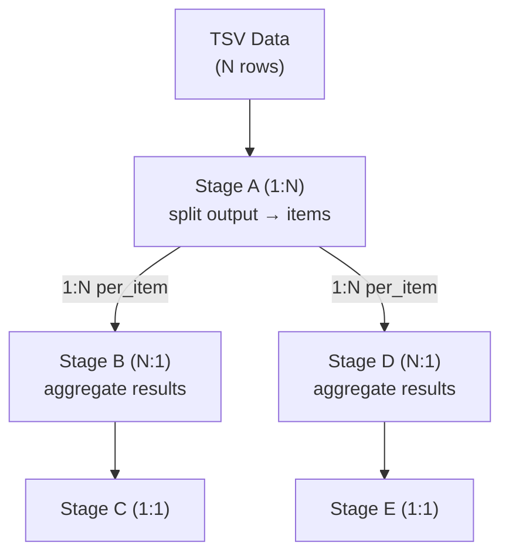
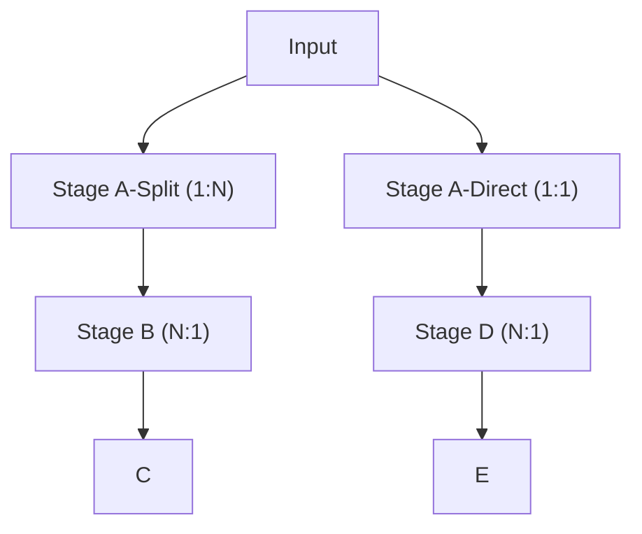

# Orchable Workflow Trace — Free BYOK Path

Phân tích 2 workflow cụ thể qua execution pipeline thực tế trong `taskExecutor.worker.ts` (IndexedDB + Web Worker).

---

## Execution Pipeline (Free BYOK)



**Routing chain**: Mỗi prompt_template lưu `next_stage_template_ids[]` → Worker hydrate `nextStageConfigs` từ đây → tạo child tasks cho stage tiếp theo.

---

## Workflow 1: Data Input (Unified TSV) → Stage A (1:1) → Stage B

### ✅ Hoàn toàn được hỗ trợ



### Trace chi tiết

| Step | Code Path | Xử lý |
|------|-----------|--------|
| 1 | `batchService.createLaunch` | Parse TSV → `inputItems[]` (N rows). Tạo N tasks cho Stage A, mỗi task có 1 row data |
| 2 | `runLoop` | Poll task `status='plan'`, sort by `step_number` → lấy Stage A tasks |
| 3 | `processTask` | Load template → build prompt → `callGemini` → save `output_data` |
| 4 | [handleNextStages:L1696](file:///Users/tonypham/MEGA/WebApp/WIP/orchable/src/workers/taskExecutor.worker.ts#L1696) | `cardinality=one_to_one` → tạo 1 task Stage B, `input_data = { ...result }` |
| 5 | Lặp lại | Stage B tasks cũng được poll và xử lý tương tự |

**Dữ liệu routing**:
```
Stage A template: { next_stage_template_ids: ["configId_stageB_nodeId"] }
Stage A task.extra: { current_stage_config: { cardinality: "one_to_one" } }
```

**Kết quả**: N input rows → N Stage A tasks → N Stage B tasks. ✅ Chạy đúng.

---

## Workflow 2: Branching với Fan-out / Fan-in

### Mô tả mong muốn

```
Data Input (Split TSV)
    → Stage A (1:N) → Stage B (N:1) → Stage C  [Nhánh 1]
    → Stage A (1:1) → Stage D (N:1) → Stage E  [Nhánh 2]
```

### ⚠️ Phân tích khả thi

Cần phân rã thành 2 vấn đề:

#### Vấn đề 1: Stage A có 2 cardinality khác nhau cho 2 nhánh?

Trong code hiện tại, **cardinality được set trên stage, không phải trên edge**:

```typescript
// handleNextStages:L1483
const cardinality = currentStageConfig.cardinality || "one_to_one";
// → Áp dụng cho TẤT CẢ next stages
```

> [!CAUTION]
> **Limitation**: Stage A không thể vừa `1:N` cho nhánh B, vừa `1:1` cho nhánh D cùng lúc. Cardinality là thuộc tính của stage, không phải thuộc tính của edge.

#### Giải pháp kiến trúc: Tách thành DAG rõ ràng



**Trong cách này, Stage A có `cardinality=one_to_many` và `next_stage_template_ids = [B, D]`.**

Khi fan-out, worker tạo child tasks cho **cả B và D** từ cùng split array:

```typescript
// handleNextStages:L1536-1601
if (Array.isArray(items)) {
  if (splitMode === "per_item") {
    for (const nextConfig of nextStageConfigs) {  // Loop qua B và D
      const newTasks = items.map((item, idx) => ({...}));
      await db.ai_tasks.bulkAdd(newTasks);
    }
  }
}
```

**Kết quả**: Nếu Stage A output có 5 items → tạo 5 tasks cho B **VÀ** 5 tasks cho D = 10 child tasks.

#### Trace N:1 Fan-in (Stage B/D → Stage C/E)

Khi task cuối cùng trong Stage B complete:

```typescript
// handleManyToOne:L1835-1845
const siblings = scopeTasks.filter(t => t.stage_key === stageKey);  // Tất cả Stage B tasks
const allSiblingsDone = siblings.every(s => s.status === "completed" || s.status === "failed");

if (allSiblingsDone) {
  // Aggregate outputs → tạo 1 task cho Stage C
  const mergedInputData = mergePath 
    ? { [mergePath]: aggregatedData }
    : { merged_data: aggregatedData };
    
  await db.ai_tasks.add({ stage_key: "stageC", input_data: mergedInputData });
}
```

Stage D → E hoạt động tương tự, **độc lập** — vì `stage_key` khác nhau.

### Kịch bản chạy thực tế (hỗ trợ được)

| Bước | Hệ thống | Tasks |
|------|----------|-------|
| 1 | Input N rows → Stage A (N tasks) | `A₁, A₂, ..., Aₙ` |
| 2 | A₁ complete → `cardinality=1:N`, split items = [x,y,z] | Tạo `B-x, B-y, B-z` **VÀ** `D-x, D-y, D-z` |
| 3 | A₂ complete → tiếp tục tạo thêm tasks cho B và D | Thêm tasks |
| 4 | Tất cả B tasks complete → `handleManyToOne` | Tạo 1 task `C` (merged data) |
| 5 | Tất cả D tasks complete → `handleManyToOne` | Tạo 1 task `E` (merged data) |

### ⚠️ Kịch bản KHÔNG hỗ trợ trực tiếp

Nếu bạn muốn **Stage A → Nhánh 1 là 1:N** nhưng **Stage A → Nhánh 2 là 1:1** (mỗi nhánh có cardinality riêng):

```
❌ Không hỗ trợ: Per-edge cardinality
```

**Workaround**: Tách Stage A thành 2 stages với cardinality khác nhau, pipe qua intermediate stage:



---

## Tóm tắt khả năng

| Workflow Pattern | Free BYOK | Ghi chú |
|-----------------|-----------|---------|
| Linear 1:1 chain | ✅ | Fully supported |
| Fan-out 1:N (per_item) | ✅ | `split_path` + `split_mode` |
| Fan-out 1:N (per_batch) | ✅ | `batch_size` chunking |
| Fan-in N:1 | ✅ | `handleManyToOne` + dedup |
| Branching (1 stage → N targets) | ✅ | Via `next_stage_template_ids[]` |
| Mixed cardinality per-edge | ❌ | Cần tách stage |
| Parallel Join (multi-parent) | ✅ | `checkDependenciesMet` |
| Sub-orchestration (nested) | ✅ | `resolveInlineMerge` |
