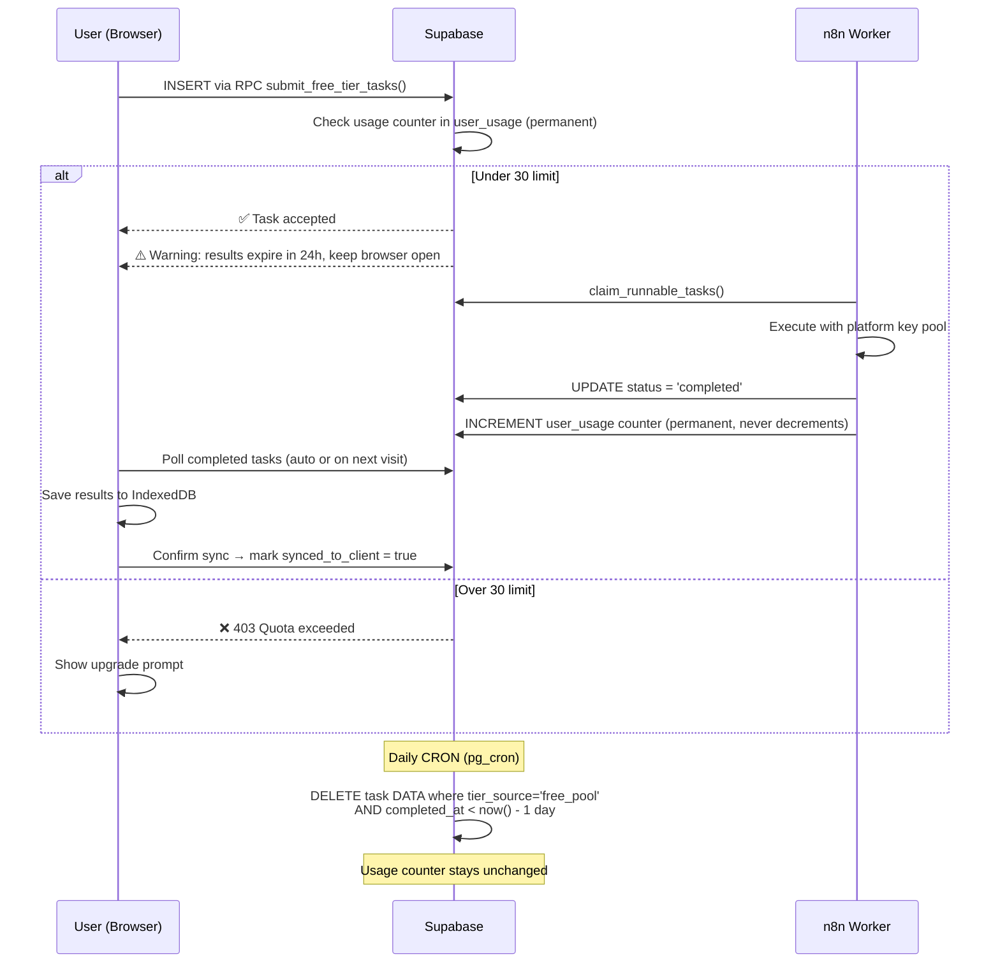

# Change: Refactor Free Tier to Server-Side Enforcement

## Why
The current Free Tier stores tasks in IndexedDB and enforces usage limits client-side. Users can bypass the monthly limit by modifying IndexedDB. Moving enforcement to Supabase eliminates this vulnerability while creating a clear upgrade incentive.

## What Changes
- **BREAKING**: Free Tier (no Key) tasks go to Supabase `ai_tasks` instead of IndexedDB; processed by n8n
- **BREAKING**: Free Tier (no Key) limit is **30 completed tasks/month** (server-enforced via permanent usage counter)
- **BREAKING**: Free Tier task **data** on Supabase auto-deleted after **1 day**, but usage count is permanent
- Free Tier + BYOK users keep local Web Worker execution (no task limit, since they pay for their own API keys)
- Premium + BYOK users still go via Supabase but use their own key (discounted billing)
- Email + in-app notification for Free Tier data expiration

## Execution Matrix

| Tier | Has BYOK | Execution | Storage | Limit |
|------|----------|-----------|---------|-------|
| Free | ✅ Yes | **Web Worker** (local) | IndexedDB | **Unlimited** |
| Free | ❌ No | **n8n** (server) | Supabase `ai_tasks` (1-day TTL) | **30/month** |
| Premium | ✅ Yes | **n8n** (server) | Supabase `ai_tasks` | Unlimited (discounted) |
| Premium | ❌ No | **n8n** (server) | Supabase `ai_tasks` | Unlimited |

## Task Counting
- Every individual `ai_tasks` row with `status = 'completed'` increments a **permanent usage counter** (`user_usage` table)
- Counter only goes up, never decrements — even when task data is deleted after 1 day
- Includes sub-tasks from multi-stage orchestrations
- Only `completed` status counts (not `plan`, `pending`, `processing`, `failed`)

## Data Lifecycle (Free Tier, No Key)

> [!IMPORTANT]
> Usage counter and task data have **separate lifecycles**.
> - **Usage counter**: Permanent. Incremented on task completion. Never decremented. Used for quota enforcement.
> - **Task data**: Ephemeral on Supabase. Deleted after 1 day. User must sync to IndexedDB to keep results.

## User Notifications (Free No-Key)
1. **At task creation**: In-app toast — "Your results will be available for 24 hours. Keep your browser open for auto-sync, or return within 1 day."
2. **Email on task creation**: "Your orchestration is running. Results expire in 24 hours."
3. **Email before cleanup**: "Your results are about to be deleted. Open Orchable now to save them."

## Impact
- **Database**: New migration (usage counter function, cleanup cron, new columns on `ai_tasks`)
- **Services**: `keyPoolService.ts`, `executorService.ts`, `usageService.ts`
- **Contexts**: `storage/index.ts`, `TierContext.tsx`
- **UI**: Launcher (quota warning), Settings (usage dashboard), email templates
- **n8n**: Key resolution for BYOK; usage counter increment on task completion

## Verification Plan
### Automated Tests
- Verify quota check uses permanent counter (not task row count)
- Verify counter does NOT decrement after CRON cleanup
- Verify Free+BYOK routes through Web Worker (no Supabase insert)
- Verify Premium+BYOK tasks use user's key
- Verify sync-back flow (Supabase → IndexedDB → confirm deletion)

### Manual Verification
- Create 30 tasks as Free (no key), verify 31st is rejected
- Wait for CRON cleanup, verify 31st is STILL rejected (counter permanent)
- Switch to BYOK, verify unlimited local execution
- Check email notification delivery
